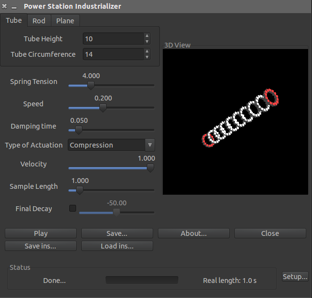

 Power Station Industrializer
-----------------------------

Copyright (c) 2000-2005 David A. Bartold

Copyright (c) 2014 Wladimir J. van der Laan

This program generates synthesized percussion sounds using physical modelling.
The range of sounds possible include but is not limited to cymbal sounds,
metallic noises, bubbly sounds, and chimes.  After a sound is rendered, it
can be played and then saved to a .WAV file.

Requires:

  * Gtk+-2.0 version 2.4.0 or higher
    (`apt-get install libgtk2.0-dev`)
  * libxml2 2.6.0 or higher
    (`apt-get install libxml2-dev`)
  * audiofile 0.2.0 or higher
    (`apt-get install libaudiofile-dev`)

Optional:

  * gtkglext-1.0 version 1.0 or higher
    (`apt-get install libgtkglext1-dev`) - required for visualization

Screenshot
-----------


There is also a [youtube demonstration](http://qubodup.wordpress.com/2012/01/25/boiing-chiing-diing-psindustrializer-generates-metal-sounds/) of an older version
by Iwan Gabovitch.

How to compile and install
---------------------------

Note: You *must* run "make install" for the About window to work.

```bash
./autogen.sh
./configure --prefix=/usr
make
make install
```

Origin
-------
The original site for this project is [on sourceforge](https://sourceforge.net/projects/industrializer/), but
it looks no longer maintained there.

License
--------

All code except that in industrial.[ch] is licensed under the GNU General
Public License version 2, or at your option, any later version.

The industrial.[ch] files are licensed under the GNU Library General
Public License version 2, or at your option, any later version.

